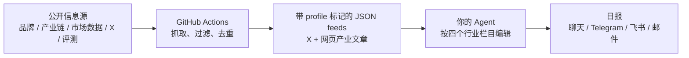

# Consumer Signal

面向消费电子行业的 AI Agent 日报：追踪终端新品、供应链与备货、行业供需/渠道，以及端侧 AI 和
新形态设备。它服务于研究，不是按公司罗列新闻，也不预设全球/中国、品牌、品类或来源类型的
比例。

中央仓库定时抓取经过过滤的公开原始信息；用户自己的 Agent 再读取 JSON，根据个人语言和写作
偏好生成日报。这样不需要为内容抓取配置 API key，也不会把用户的阅读反馈上传到中央服务。默认
输出语言为中文；可在个人配置中覆盖。

## 日报结构

日报按信息本身的行业意义组织，空栏目不强行填充：

1. **终端新品、研发与市场评价**：研发、发布、上市、价格、规格与真实体验。
2. **供应链、备货与新技术**：供应商、订单、产能、元件、工艺和技术路线。
3. **行业供给、需求与渠道**：出货、销量、份额、ASP、库存、促销、渠道与进出口。
4. **端侧 AI 与新形态设备**：AI 手机、AI PC、AI 眼镜、XR、穿戴、音频和新的交互终端。

每条应标注证据等级：`[官方]`、`[数据/研究]`、`[报道/分析]`、`[线索/传闻]` 或
`[评测/口碑]`。泄露、供应链爆料和单一 KOL 判断必须保留条件语气，不能包装为已确认事实。

原始 feeds 保留同一事件的所有可归因来源，便于回溯。生成日报 payload 时会进行保守的事件级合并：
优先选择证据等级最高的主条目，并将其他相同事件的报道、官方披露或 X 帖子保留在
`supporting_sources` 中作为佐证链接。新品发布、后续评测、独立供应链变化等不同性质的信号不会
因涉及同一产品而被强行合并。

## 已接入与候选来源

首期公开抓取包括 Apple、Samsung、Google Devices、Meta Quest / AI 眼镜、Huawei、Xiaomi、OPPO、vivo、Qualcomm、MediaTek、巨潮资讯中的核心 A 股消费电子供应链公司法定披露、台湾经济日报产业页、郭明錤 / Ming-Chi Kuo、DigiTimes、IDC Consumer RSS、Counterpoint Research、CINNO Research、GSMArena、The Verge、
9to5Mac、MacRumors、爱范儿、iFixit，以及供应链、市场、爆料和评测方向的精选 X 账号。极客湾 Geekerwan 的官方 YouTube Atom endpoint 当前返回 404，已暂停而非伪造更新；其余 X 抓取需要维护者在
GitHub Actions 中提供合规的 `TWITTER_COOKIES`；没有会话时不会伪造 X 更新。

候选目录在 [config/source-catalog.consumer-electronics.json](config/source-catalog.consumer-electronics.json)，
包含 工商时报、DSCCRoss、Canalys、Omdia、TechInsights、
RUNTO、AVC、海关数据，以及用户指定的新品/评测来源。付费、登录、robots 或稳定性受限
的站点会保留为待接入状态，不会被误称为已抓取。

核心选词和排除规则见
[config/filter-terms.consumer-electronics.json](config/filter-terms.consumer-electronics.json)。规则是：命中
高优先级词，或同时满足“终端/产业链主体”和“有效行业信号”；泛 AI、抽奖、导购和无关科技新闻会
被排除。

没有品牌、地域或单一信息源的编辑配额，也不再对单一源设置默认条数上限；包括 X 在内，是否进入原始
抓取结果只由公开可访问性、发布时间、内容相关性和去重规则决定。为减少脱离上下文的噪声，X 默认不收录
回复帖和转帖；这不是数量配额。

## 工作原理



`profile: consumer_electronics` 是迁移保护：客户端会拒绝旧 `ai-signal` 的缓存，避免把 AI 模型、
播客或论文误渲染为消费电子日报。

## 使用方式

先发布你自己的 Consumer Signal 仓库。运行时和订阅端不会默认回退到原 `ai-signal` 地址。

```bash
export CONSUMER_SIGNAL_REPO_URL="https://github.com/<owner>/consumer-signal.git"
git clone "$CONSUMER_SIGNAL_REPO_URL" ~/.claude/skills/consumer-signal
python -m pip install -r ~/.claude/skills/consumer-signal/requirements.txt
```

在 `~/.consumer-signal/config.json` 填入中央 feed 根地址：

```json
{
  "language": "zh",
  "granularity": "summary",
  "timezone": "Asia/Shanghai",
  "domains": ["consumer_electronics"],
  "feed_base_urls": [
    "https://raw.githubusercontent.com/<owner>/consumer-signal/main"
  ],
  "delivery": {"method": "stdout"}
}
```

随后让你的 Agent 使用 `/consumer-signal`，或执行：

```bash
python scripts/prepare_digest.py
```

它会生成 payload；Agent 只使用其中的 JSON 和 `prompts/` 写日报。无模型场景可使用：

```bash
python scripts/prepare_digest.py | python scripts/render_digest.py
```

## 维护者：更新 feeds

安装中央依赖后运行：

```bash
python -m pip install -r requirements-central.txt
TWITTER_COOKIES='<your authorized session>' python scripts/generate_feed.py
```

脚本会把每种输出标记为 `consumer_electronics`。GitHub Actions 在北京时间 06:00 自动执行相同流程。
可选的 `scripts/generate_summaries.py` 只为已过滤的 X 和网页文章生成“来源受限”的缓存摘要；普通用户
路径仍然是 JSON-first。

如果某一整类来源（X、网页、播客或研究）在运行时全部失败，系统会保留其最后一次成功的 feed，并写入
`degraded`、`attempted_at` 和 `errors`；不会用空结果覆盖旧数据，也不会把旧数据的时间改写为最新时间。
订阅端会将该状态作为非致命提示显示出来。

## 配置与隐私

- 本地偏好、已读状态和反馈只保存在 `~/.consumer-signal/`。
- 推送密钥放在 `~/.consumer-signal/.env`，不提交到仓库。
- 用户可覆盖 `~/.consumer-signal/prompts/` 中的写作提示，但不应把阅读偏好改成固定地区或品牌配额。
- 详细的 Agent 运行说明见 [SKILL.md](SKILL.md) 与 [references/](references/)。

## License

MIT
